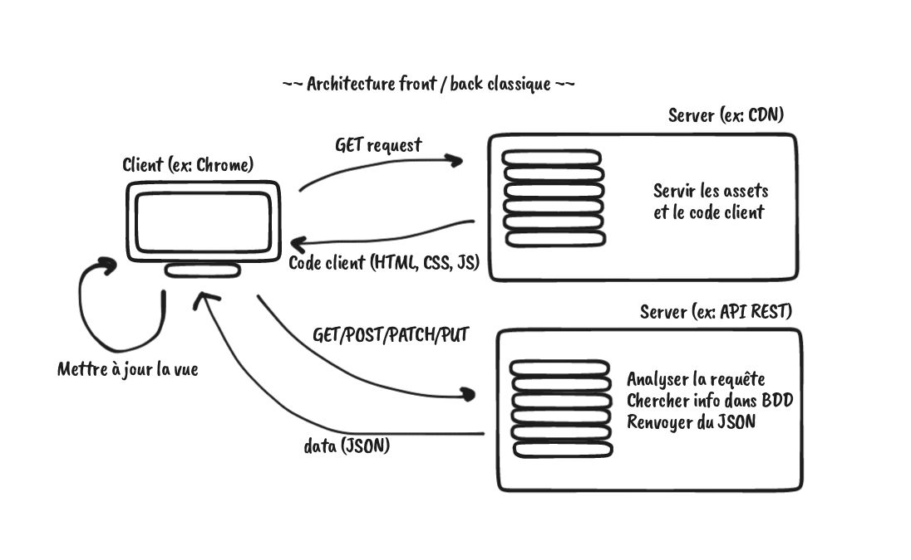

# O'Kanban - E01 - API & AJAX

## Menu du jour

- Cockpit
  - `API`
  - `AJAX`
  - Setup `GitHub`

- Atelier
  - `MCD`
  - `User-stories`
  - `Wireframes` (bonus)


## API

API : Application Programming Interface (🇫🇷 Interface de Programmation)

Une web API :
- Interface dont les données requêtées (via une URL) transitent via le protocole HTTP 
- Renvoie généralement des données structurées (ex: `JSON`)
- Peuvent être requété par différents clients (ex: `Navigateur`, `Mobile`, `Terminal` (`curl`), `Insomnia`, `Postman`, `VSCode` (`REST Client`))


#### Exemple 

Quelques exemples d'API HTTP : 
- Liste:
  - https://github.com/public-api-lists/public-api-lists
- Vus en cours :
  - https://geo.api.gouv.fr/regions
  - https://www.omdbapi.com/?s=harry%20potter&apikey=1e58f63b
  - https://developer.spotify.com/documentation/web-api/reference/#/operations/get-playlist (⚠️ authentification requise)
  - https://pokeapi.co/docs/v2


## AJAX

`Asynchronous Javascript And XML`: 
- Sert à requêter une API sans recharger la page 
  - (donc très utile pour les `SPA` Single Page Applications)

- Exemple de requête AJAX : l'autocomplétion de google

Exemple de code pour faire des requêtes AJAX en javascript en utilisant [fetch](https://developer.mozilla.org/fr/docs/Web/API/Fetch_API/Using_Fetch)

```js
fetch(URL_STRING, OPTIONS) // Requêter de manière asynchrone
  .then(httpResponse => httpResponse.json()) // Transformer le body de la réponse HTTP en JSON
  .then(data => { // Récupérer ce json
    console.log(data); // Afficher ses données
  });


// Ou dans une fonction async :
async function requestData() {
  const httpResponse = await fetch(URL_STRING, OPTIONS);
  const data = await httpResponse.json();
  console.log(data);
}

requestData();
```

## Glossaire

- `CDN`: Content Delivery Network: un ensemble de serveur pour servir des ressources statiques (ex: html, css, js, images, ...)
- `SPA`: Single Page Application


## Architecture client/serveur



### Avantages

- SoC: séparatin claire du code client et code backend (donc potentiellement plusieurs équipes sur chaque projet)
  - meilleur modularisation du code
- (Re)chargement constant de page (SPA)
- Facilite l'ajout de nouveaux clients (ex: mobile code et desktop code consomment la même API pour récupérer les données)
- (bonus) Facilite l'utilisation de CDN 

### Inconvénients

- Architecture plus lourde donc plus lourde à maintenir
  - plus de configuration probablement
- Sécurité :
  - Bien protéger son API 
- Premier chargement de la page peut être un peu lourd
